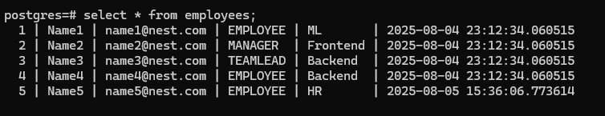
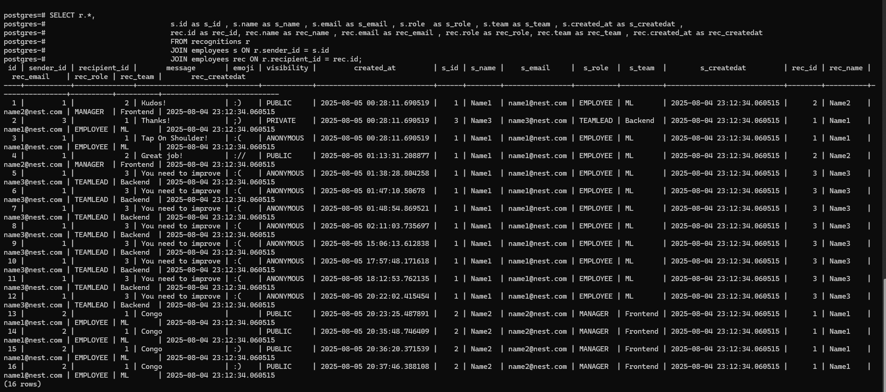
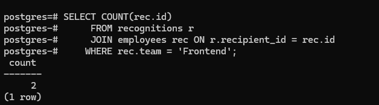
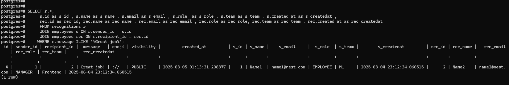
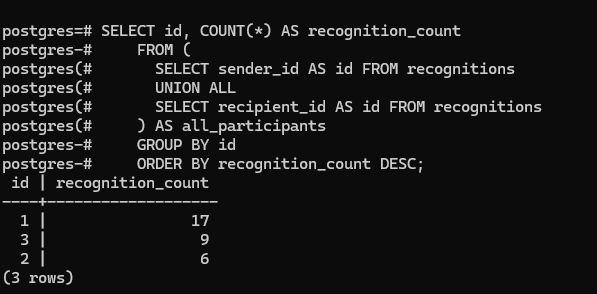

## Queries

### (server/src/resolvers.ts, server/src/analytics.ts)

    I chose a relational database for the task because
    1. We have tightly coupled entities such as recognitions which need a sender, reciever information
    and we can get a easy relationship using Primary, Foreign keys and joins work really well in case
    data from multiple tables is needed

    2. SQL databases such as Postgresql provide ACID guarentee as well as scope for complex queries such
    as triggers, functions, if needed in the future.

    3. Very Easy for analysis purposes. (Pandas, Numpy can also be used on sql data)

    4. Postgresql gives good backup options such as pg_backrest, incremental backups, WALs (write ahead logs)
    , etc.

    We can create similar tables for Likes, Reactions, Comments, etc and write very similar queries to fetch
    data which is why I though this is a solid approach.
    As far as integration, we can create webhooks in the frontend and have third party apps trigger webhooks
    through APIs for recognitions and stuff.

### 1. Get Employee Details

    By using simple sql query from table Employees,
    'SELECT * FROM employees;'
    we can get all employee data.
    This looks like
    

### 2. Get All Recognition Details

    Here I have used a sql query to get info of all recognitions.
    The sql query is
    SELECT r.*,
        s.id as s_id , s.name as s_name , s.email as s_email , s.role  as s_role , s.team as s_team , s.created_at as s_createdat ,
        rec.id as rec_id, rec.name as rec_name , rec.email as rec_email , rec.role as rec_role, rec.team as rec_team , rec.created_at as rec_createdat
        FROM recognitions r
        JOIN employees s ON r.sender_id = s.id
        JOIN employees rec ON r.recipient_id = rec.id

    I have joined both tables to get proper details of sender and reciever in same format as an employee
    and I get below result
    

## Queries for Analytics

### 3. Get Number of Recognitions By Team (Ex: Frontend)

    I have used below sql query to get number of recognitions by a specific team.
    We can edit the team or pass an argument with name of the team later on to get variety of statistics.

    Sql query is
    SELECT COUNT(rec.id)
    FROM recognitions r
    JOIN employees rec ON r.recipient_id = rec.id
    WHERE rec.team = 'Frontend';

    

### 4. Get Recognitions by Keywords (Ex: 'Great Job')

    I have used below sql query to get all recognitions by specific keywords.
    We can edit the keywords or pass an argument of keywords later on to get specific recognitions.

    SELECT r.*,
    s.id as s_id , s.name as s_name , s.email as s_email , s.role  as s_role , s.team as s_team , s.created_at as s_createdat ,
    rec.id as rec_id, rec.name as rec_name , rec.email as rec_email , rec.role as rec_role, rec.team as rec_team , rec.created_at as rec_createdat
    FROM recognitions r
    JOIN employees s ON r.sender_id = s.id
    JOIN employees rec ON r.recipient_id = rec.id
    WHERE r.message ILIKE '%Great job%';

    

### 5. Get Recognition Count of Each Employee

    Right now I have created a query that gives Id of the  employee with their recognition.
    We can later on join Employee table to get all info about employees.

    SELECT id, COUNT(*) AS recognition_count
    FROM (
      SELECT sender_id AS id FROM recognitions
      UNION ALL
      SELECT recipient_id AS id FROM recognitions
    ) AS all_participants
    GROUP BY id
    ORDER BY recognition_count DESC;

    
